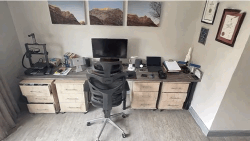

# Rad-Det: Enhancing 3D Object Detection in Discrete Radiance Fields with Sparse-Dense CNNs

<a href="https://janco.v-eeden.com/" style="font-size:100%;">Janco van Eeden</a>&emsp;
<a href="https://www.up.ac.za/faculty-of-engineering-built-environment-it/view/staffprofile/9478" style="font-size:100%;">Hans Grobler</a>&emsp;

 

This repository provides a preview for my dissertation completed for a Master of Engineering at the University of Pretoria

